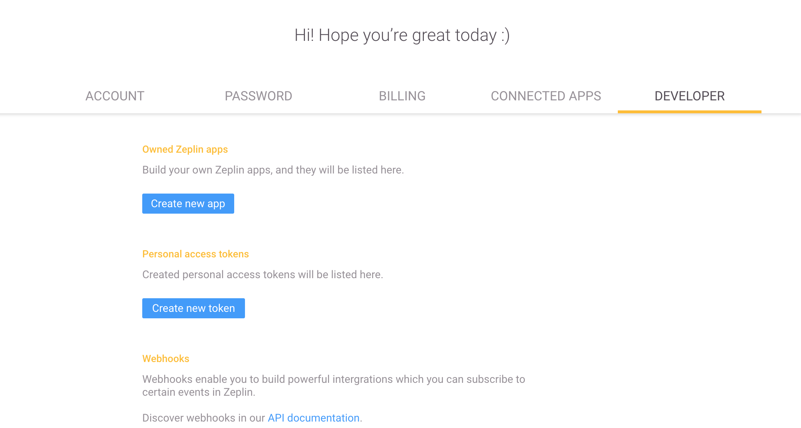
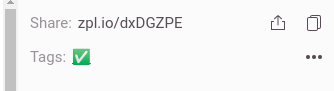
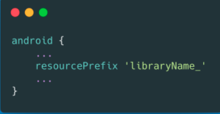
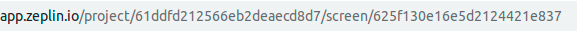

# zeplin-asset-download-gradle-plugin-template 🐘

A simple gradle plugin that lets you create a **download asset from zeplin  and convert them to vector drawables automatically** 
🐘 project using **100% Kotlin** and be up and running in a **few seconds**. 

## How to use 👣
The plugin is developed based on Zeplin API, it's used **zeplin OAuth2** to verify the project have correct access.

try to add the plugin to the **project.gradle** you want to use,
<details>
  <summary>groovy</summary>
  <code>
   
    plugins {
        ...
        id("io.github.qifan.zeplin.gradle")
    }

    zeplinConfig {
        zeplinToken = "input the correct zeplin token"
        configFile = file("input the correct zeplin file")
    }
</code>
</details>

<details>
  <summary>kotlin</summary>
  <code>

    plugins {
        ...
        id("io.github.qifan.zeplin.gradle")
    }

    zeplinConfig {
        zeplinToken.set("input the correct zeplin token")
        configFile.set(file("input the correct zeplin file"))
    }
</code>
</details>

then execute the script that's it !
```groovy
./gradlew your_project:updateZeplin
```

### Zeplin Developer Token 🔍
To use this plugin, you either need to create a personal access token or a Zeplin app. 
You can create them from the web app under Developer tab in your profile page.


### Configuration ⚙️
Before starting directly `zeplin script`, besides that **zeplin token** above, we also need a configuration file to tell plugin
which kind of assets the plugin want to download.
```json
{
  "projectId": "input the zeplin project id",
  "tagName": [],
  "outputDir": "",
  "resourcePrefix": "",
  "deniedList": {
    "screen_ids": []
  },
  "allowList": {
    "screen_ids": [""]
  }
}
```
| Attributes |                                     Meaning                                      | Example to get the information |
|------------|:--------------------------------------------------------------------------------:|-------------------------------:|
| projectId  |                               id of zeplin project                               |       |
| tagName    | tag of screens which allow you download the assets with the same name collection |             |
| outputDir  |  output directory where you want to assign plugin to put converted assets into   |                                |
| resourcePrefix  |               android resource prefix to avoid resource conflicts                |          |
| deniedList  |         denied list screens in case some of screens you want to include          |        |
| allowList  |         denied list screens in case some of screens you want to exclude          |        |


## Example 📦
The example project is to display how the zeplin works and what kind of configuration needs to be added
you can check it in [example](example) folder.

## Features 🎨

- **100% Kotlin-only**.
- Zeplin API and vector drawable converted automatically
- Plugin build setup with **composite build**.
- CI Setup with GitHub Actions.


## Contributing 🤝

Feel free to open an issue or submit a pull request for any bugs/improvements.
This plugin is based on static analysis check, you can use `preMerge` task to test it.

A `preMerge` task on the top level build is already provided in the project. This allows you to run all the `check` tasks both in the top level and in the included build.

You can easily invoke it with:

```
./gradlew preMerge
```

If you need to invoke a task inside the included build with:

```
./gradlew -p plugin-build <task-name>
```

## License 📄

This template is licensed under the Apache License - see the [License](License) file for details.
Please note that the generated template is offering to start with a MIT license but you can change it to whatever you wish, as long as you attribute under the MIT terms that you're using the template. 
